# 🖼️ Galería — El Huerto de Sofía

Todo el arte y las capturas del juego en un solo lugar. Las imágenes son
los archivos reales del repo (no copias), así que si regenerás un asset
esta página se actualiza sola.

Cómo se generó cada cosa está en el [`README.md`](README.md); acá es
puro mirar.

---

## 📱 El juego andando

Capturas reales del build actual, corriendo a 540×1170 (la proporción
19.5:9 de un celular alto).

<table>
<tr>
<td align="center" width="33%">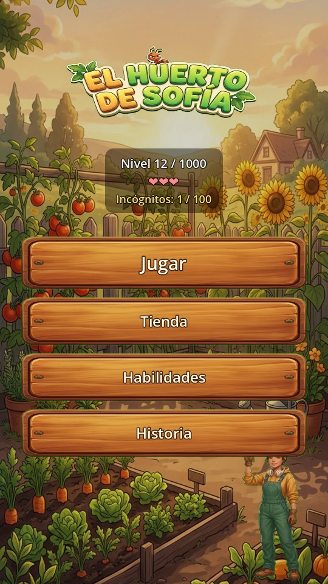 <b>Menú principal</b> fondo ilustrado, logo y carteles de madera</td>
<td align="center" width="33%">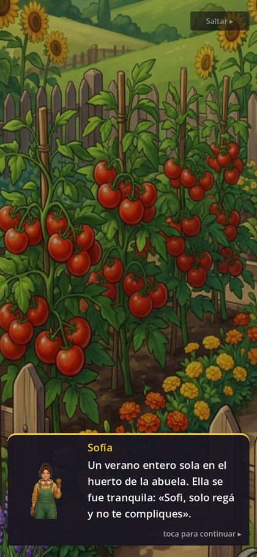 <b>Diálogo de Sofía</b> un retrato distinto por emoción</td>
<td align="center" width="33%">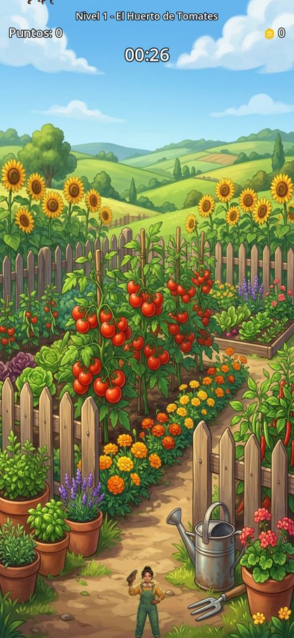 <b>Partida</b> HUD, insectos y Sofía abajo</td>
</tr>
</table>

### Los menús

Las cuatro pantallas de menú comparten fondo ilustrado, carteles de
madera y tarjetas, todo desde `scripts/ui/ui_theme.gd`.

<table>
<tr>
<td align="center" width="25%">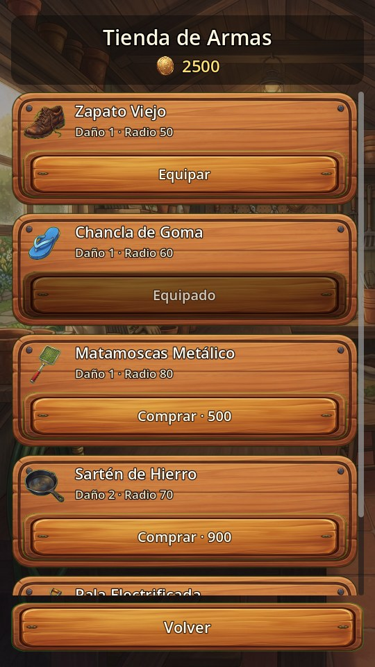 <b>Tienda</b> tarjeta por arma, con ícono y precio</td>
<td align="center" width="25%">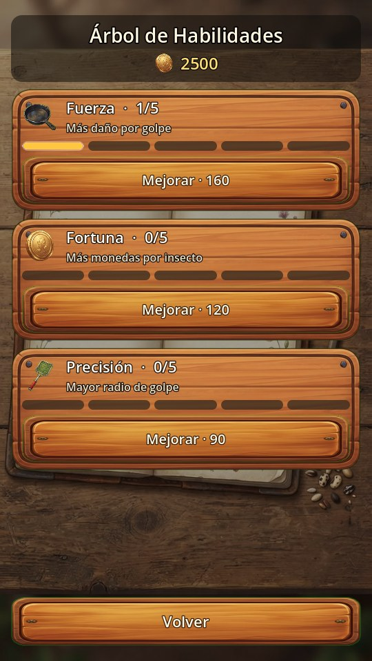 <b>Habilidades</b> 5 casilleros por rama en vez de una barra</td>
<td align="center" width="25%">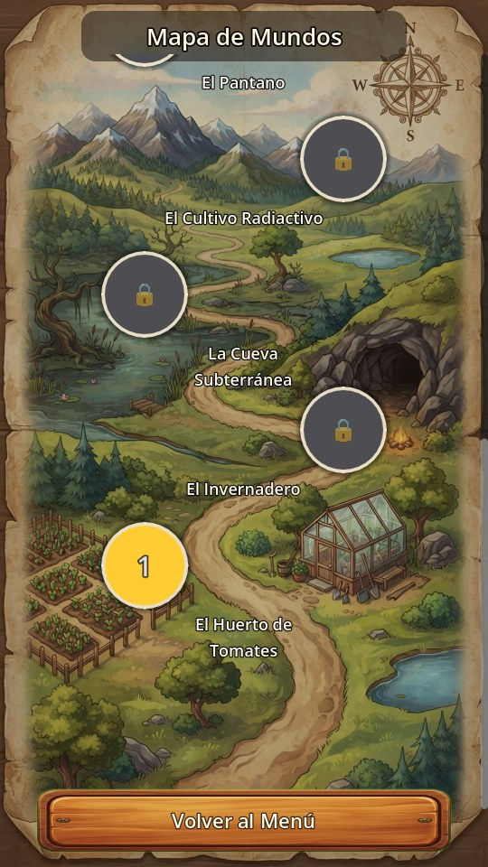 <b>Mapa de mundos</b> pergamino con los 10 capítulos en zigzag</td>
<td align="center" width="25%">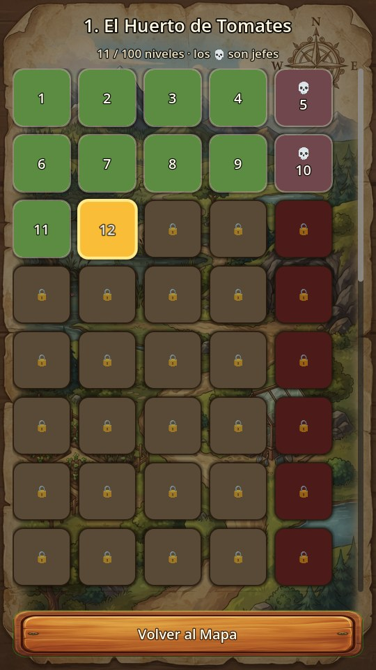 <b>Selector de niveles</b> 💀 son jefes; se puede rejugar</td>
</tr>
</table>

### Efectos de golpe

Capturado cuadro a cuadro desde adentro de Godot. Izquierda: la
salpicadura con sus gotas. Derecha: el zapato bajando, achatándose
contra el suelo en el impacto y levantándose.

---

## 👧 Sofía

Seis retratos, uno por emoción. El sistema de diálogo cambia la textura
según la emoción de cada línea del guion (`StoryData`). Están recortados
a busto para que la cara se lea en la caja de diálogo, que es chica.

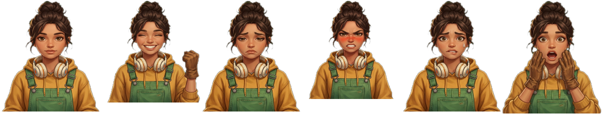

neutral · feliz · triste · enojada · preocupada · sorprendida

Y las dos de cuerpo entero: la de la partida (con el zapato en alto) y
la del menú (saludando).

<table>
<tr>
<td align="center">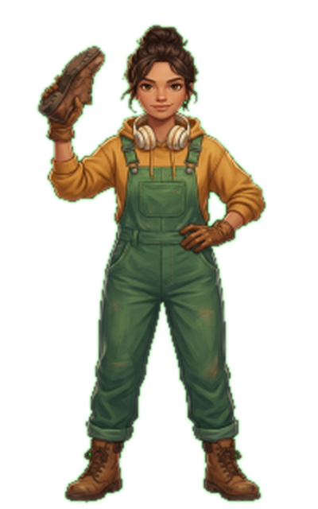 <b>en la partida</b></td>
<td align="center">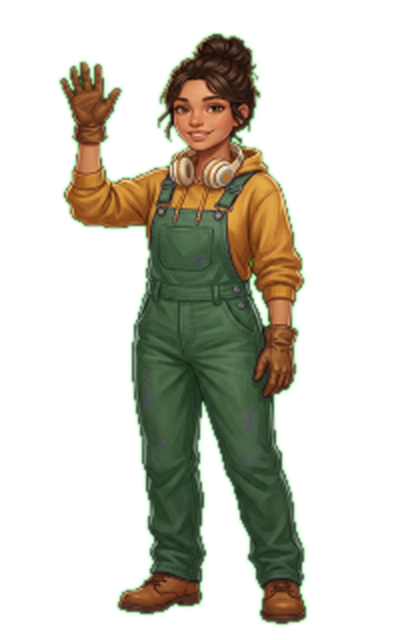 <b>en el menú</b></td>
</tr>
</table>

---

## 🎬 Interfaz del menú

<table>
<tr>
<td align="center">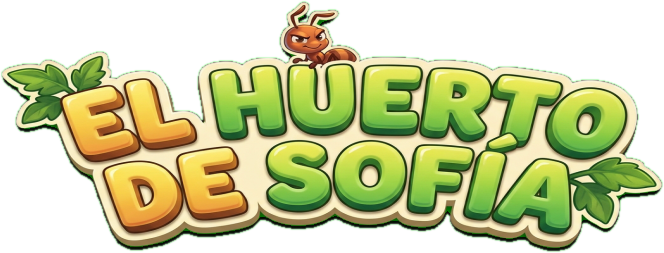 <b>Logo</b></td>
<td align="center">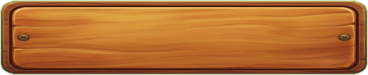 <b>Cartel de madera</b> una sola imagen, 9-slice, con el texto por código</td>
</tr>
<tr>
<td align="center">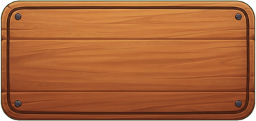 <b>Tarjeta</b> fila de la tienda y del árbol de habilidades</td>
<td align="center">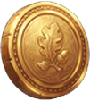 <b>Moneda</b> reemplaza el emoji 🪙 del contador</td>
</tr>
</table>

Las dos imágenes de 9-slice están **recortadas al bbox de su parte
opaca**. Salieron del generador con muchísimo margen transparente
alrededor (el cartel era 512×160 con 468×96 de madera real); sin
recortar, el 9-slice estira ese vacío y la madera queda corrida
respecto del texto que va encima.

---

## 🐜 Ciclo de caminata

Los **5 insectos comunes** tienen ciclo de caminata de 4 cuadros. Cada
uno se generó como una sola grilla 2×2 (así el bicho no cambia de forma
entre cuadros) y después se partió con `tools/split_sheet.py`. Acá el de
la `hormiga_obrera`:

<table>
<tr>
<td align="center">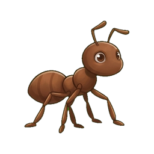 1</td>
<td align="center">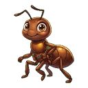 2</td>
<td align="center">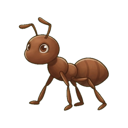 3</td>
<td align="center">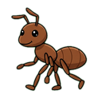 4</td>
</tr>
</table>

> Los 10 insectos incógnito todavía usan un cuadro fijo con balanceo
> procedural. Para sumarle ciclo a alguno: generá la grilla 2×2 y pasala
> por `tools/chroma_key.py` y `tools/split_sheet.py`.

---

## 🐛 Insectos

### Comunes — los que aparecen como enemigos normales

<table>
<tr>
<td align="center">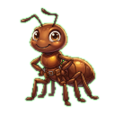 <b>Hormiga Obrera</b> vel 100 · vida 1 · 50 pts</td>
<td align="center">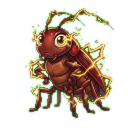 <b>Cucaracha Eléctrica</b> vel 200 · vida 1 · 75 pts</td>
<td align="center">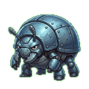 <b>Escarabajo Blindado</b> vel 50 · vida 3 · 150 pts</td>
<td align="center"> <b>Mosca Pesada</b> vel 150 · vida 1 · 100 pts</td>
<td align="center">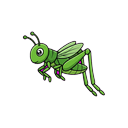 <b>Grillo Saltarín</b> vel 120 · vida 1 · 80 pts</td>
</tr>
</table>

### El incógnito

Aparece como silueta y se va revelando a medida que le pegás. Al llegar
a 100% se descubre cuál era y se suma a la colección.

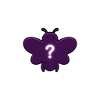

### Incógnitos revelados — uno por capítulo

<table>
<tr>
<td align="center">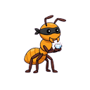 <b>1.</b> Hormiga Ladrona de Diamantes</td>
<td align="center">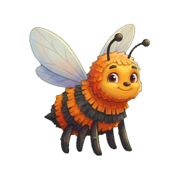 <b>2.</b> Abejorro Piñata</td>
<td align="center">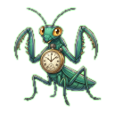 <b>3.</b> Mantis Cronómetro</td>
<td align="center"> <b>4.</b> Escarabajo Radiactivo</td>
<td align="center">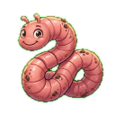 <b>5.</b> Lombriz Gigante</td>
</tr>
<tr>
<td align="center">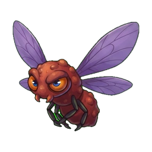 <b>6.</b> Mutagénesis Voladora</td>
<td align="center">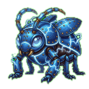 <b>7.</b> Centella Blindada</td>
<td align="center">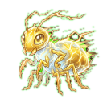 <b>8.</b> Rayo Insecto</td>
<td align="center">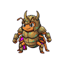 <b>9.</b> Coraza Antigua</td>
<td align="center">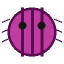 <b>10.</b> Reina Primordial <i>jefe final</i></td>
</tr>
</table>

---

## 🥿 Armas

En orden de desbloqueo. El arma equipada es la que se ve bajando cuando
tocás la pantalla, y su tamaño en pantalla escala con su radio.

<table>
<tr>
<td align="center">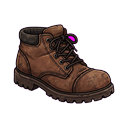 <b>Zapato Viejo</b> daño 1 · radio 50 <i>gratis</i></td>
<td align="center">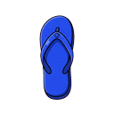 <b>Chancla de Goma</b> daño 1 · radio 60 200 🪙</td>
<td align="center">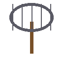 <b>Matamoscas Metálico</b> daño 1 · radio 80 500 🪙</td>
<td align="center">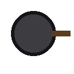 <b>Sartén de Hierro</b> daño 2 · radio 70 900 🪙</td>
<td align="center">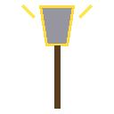 <b>Pala Electrificada</b> daño 2 · radio 90 1500 🪙</td>
</tr>
</table>

---

## 🌄 Fondos de capítulo

Los 10 están incluidos en el APK, aunque la demo solo llega jugable
hasta el capítulo 1.

<table>
<tr>
<td align="center">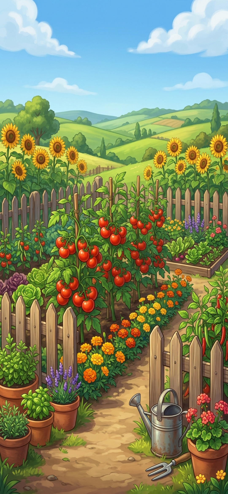 <b>1.</b> El Huerto de Tomates</td>
<td align="center">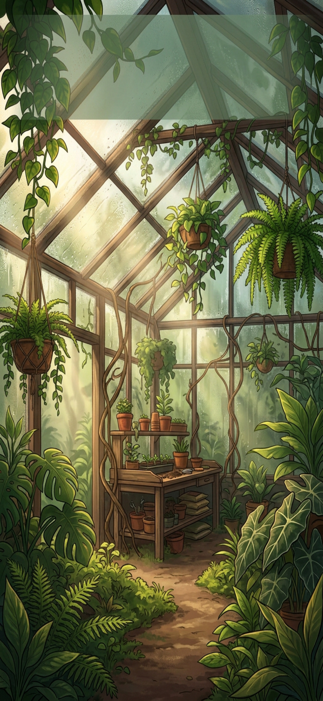 <b>2.</b> El Invernadero</td>
<td align="center">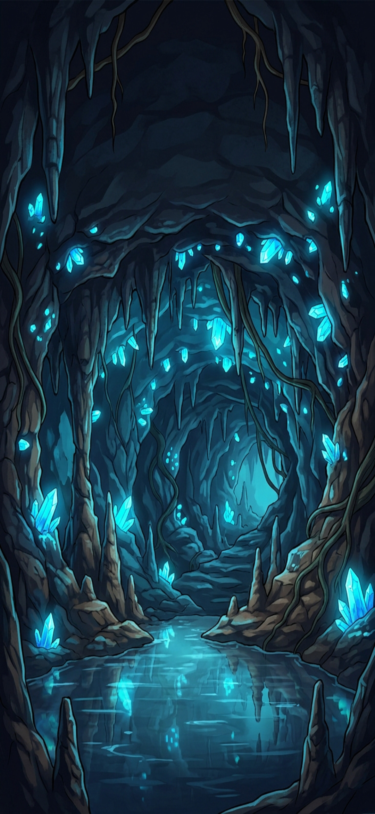 <b>3.</b> La Cueva Subterránea</td>
<td align="center">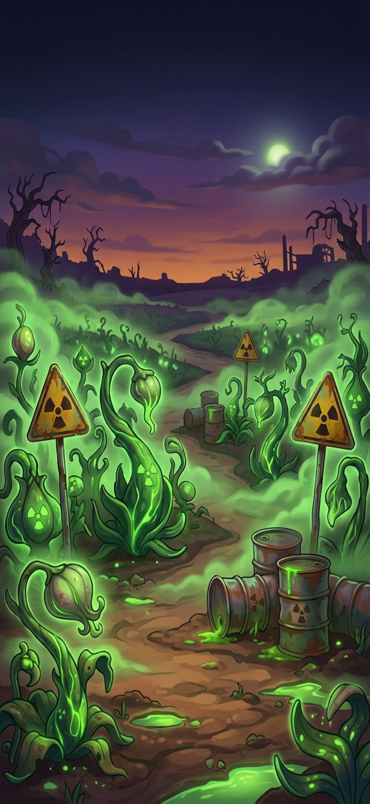 <b>4.</b> El Cultivo Radiactivo</td>
<td align="center">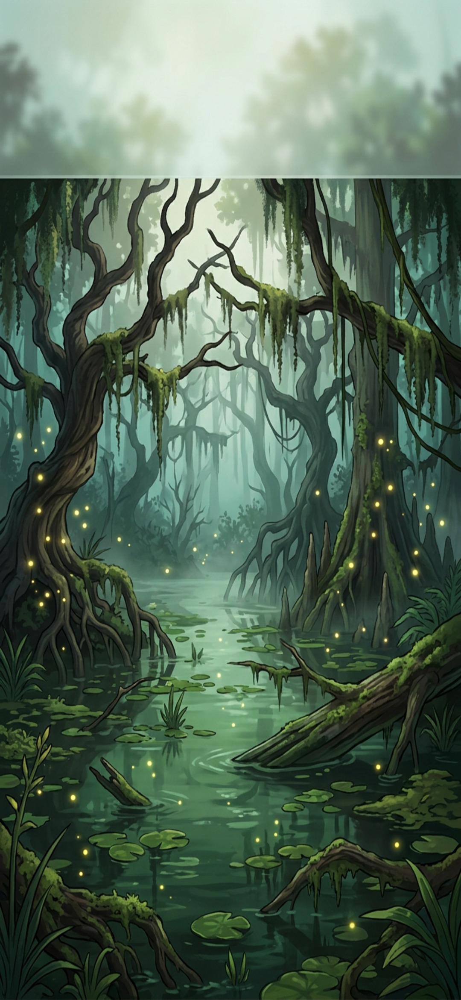 <b>5.</b> El Pantano</td>
</tr>
<tr>
<td align="center">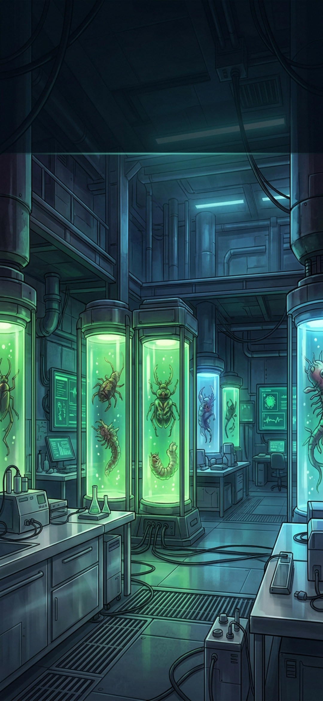 <b>6.</b> Laboratorio Mutante</td>
<td align="center">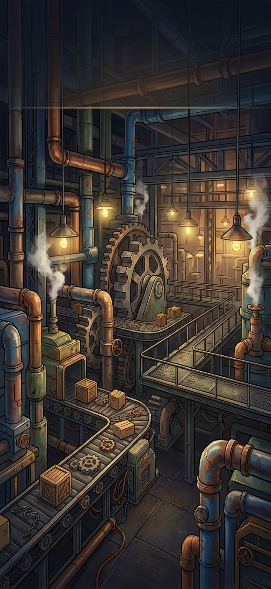 <b>7.</b> La Fábrica</td>
<td align="center">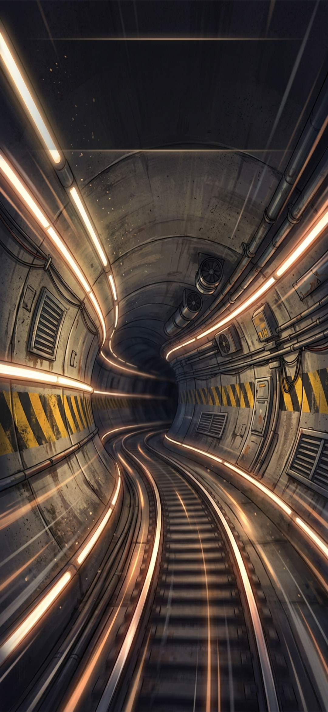 <b>8.</b> Los Túneles</td>
<td align="center">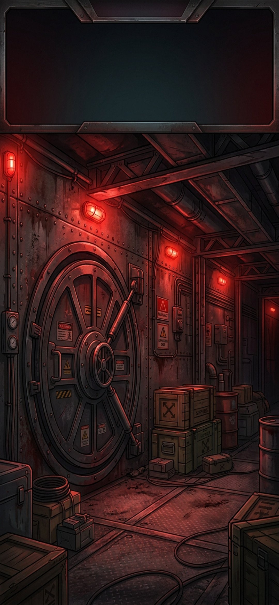 <b>9.</b> El Búnker</td>
<td align="center">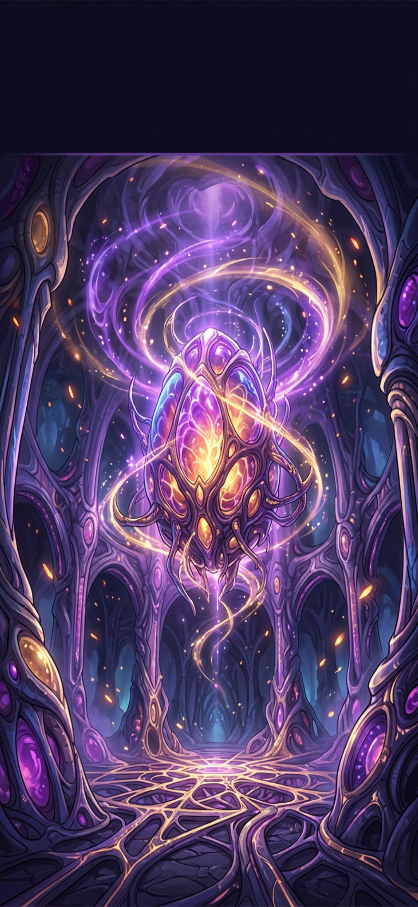 <b>10.</b> El Núcleo</td>
</tr>
</table>

---

## 📦 Ícono de la app

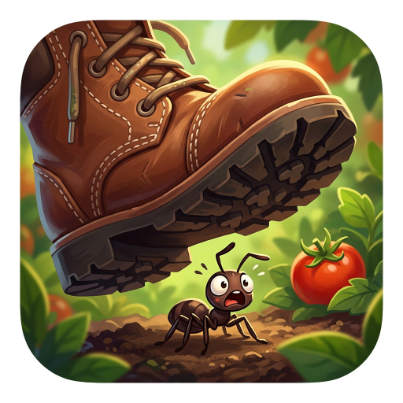

---

## Resumen

| | Cantidad |
|---|---|
| Insectos | 16 (5 comunes + 1 silueta + 10 incógnitos) |
| Cuadros de caminata | 20 (4 × los 5 insectos comunes) |
| Retratos de Sofía | 6 emociones + 2 de cuerpo entero |
| Armas | 5 |
| Fondos de capítulo | 10 |
| Ícono | 1 |
| Interfaz del menú | 3 (fondo, logo, cartel) |
| **Total de imágenes** | **68** |
| Pistas de música | 11 (Suno) |
| Efectos de sonido | 11 (CC0, Kenney.nl) |
