# 🖼️ Galería — ¡Invasión en el Huerto!

Todo el arte y las capturas del juego en un solo lugar. Las imágenes son
los archivos reales del repo (no copias), así que si regenerás un asset
esta página se actualiza sola.

Cómo se generó cada cosa está en el [`README.md`](README.md); acá es
puro mirar.

---

## 📱 El juego andando

Capturas reales del build actual, corriendo a 540×1170 (la proporción
19.5:9 de un celular alto).

<table>
<tr>
<td align="center" width="25%">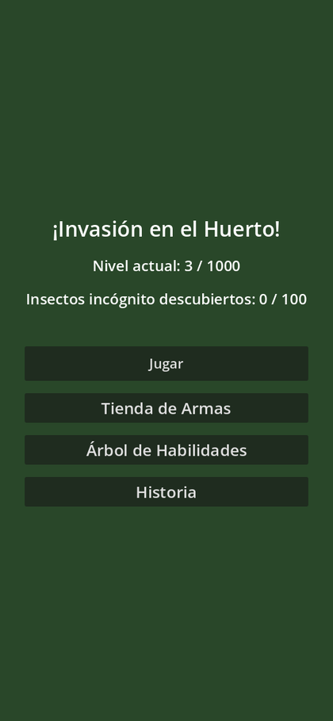 <b>Menú principal</b></td>
<td align="center" width="25%">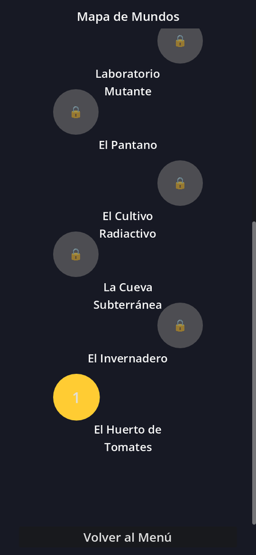 <b>Mapa de mundos</b> capítulo actual en dorado, el resto con candado</td>
<td align="center" width="25%"> <b>Diálogo de Don Beto</b> retrato real por emoción</td>
<td align="center" width="25%"> <b>Partida</b> HUD, hormigas y contador</td>
</tr>
</table>

### Efectos de golpe

Capturado cuadro a cuadro desde adentro de Godot. Izquierda: la
salpicadura con sus gotas. Derecha: el zapato bajando, achatándose
contra el suelo en el impacto y levantándose.

---

## 👨‍🌾 Don Beto

Cinco retratos reales, uno por emoción. El sistema de diálogo cambia la
textura según la emoción de cada línea del guion (`StoryData`), en vez
de teñir un único sprite como hacía antes.

<table>
<tr>
<td align="center">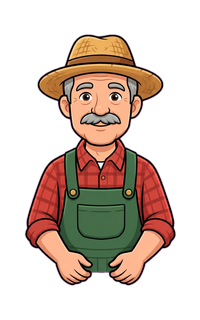 <b>neutral</b></td>
<td align="center">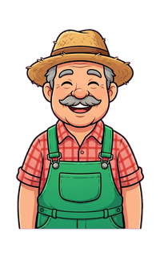 <b>feliz</b></td>
<td align="center">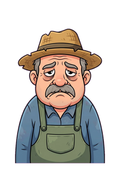 <b>triste</b></td>
<td align="center">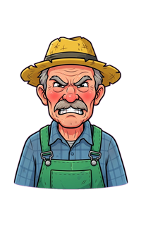 <b>enojado</b></td>
<td align="center">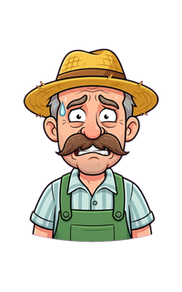 <b>preocupado</b></td>
</tr>
</table>

Y el Don Beto de cuerpo entero, el que se ve abajo en la pantalla de
juego:

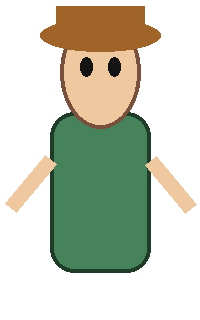

---

## 🐜 Ciclo de caminata

Los 4 cuadros de la `hormiga_obrera`, generados como una sola grilla 2×2
para que el bicho no cambie de forma entre cuadros, y después partidos
en post-proceso:

<table>
<tr>
<td align="center"> 1</td>
<td align="center"> 2</td>
<td align="center"> 3</td>
<td align="center"> 4</td>
</tr>
</table>

> Es el único insecto con caminata animada por ahora. El resto usa un
> cuadro fijo con balanceo procedural. Para sumarle ciclo a otro, ver
> "Más ciclos de caminata" en el README.

---

## 🐛 Insectos

### Comunes — los que aparecen como enemigos normales

<table>
<tr>
<td align="center"> <b>Hormiga Obrera</b> vel 100 · vida 1 · 50 pts</td>
<td align="center"> <b>Cucaracha Eléctrica</b> vel 200 · vida 1 · 75 pts</td>
<td align="center"> <b>Escarabajo Blindado</b> vel 50 · vida 3 · 150 pts</td>
<td align="center"> <b>Mosca Pesada</b> vel 150 · vida 1 · 100 pts</td>
<td align="center"> <b>Grillo Saltarín</b> vel 120 · vida 1 · 80 pts</td>
</tr>
</table>

### El incógnito

Aparece como silueta y se va revelando a medida que le pegás. Al llegar
a 100% se descubre cuál era y se suma a la colección.

### Incógnitos revelados — uno por capítulo

<table>
<tr>
<td align="center"> <b>1.</b> Hormiga Ladrona de Diamantes</td>
<td align="center"> <b>2.</b> Abejorro Piñata</td>
<td align="center"> <b>3.</b> Mantis Cronómetro</td>
<td align="center"> <b>4.</b> Escarabajo Radiactivo</td>
<td align="center"> <b>5.</b> Lombriz Gigante</td>
</tr>
<tr>
<td align="center"> <b>6.</b> Mutagénesis Voladora</td>
<td align="center"> <b>7.</b> Centella Blindada</td>
<td align="center"> <b>8.</b> Rayo Insecto</td>
<td align="center"> <b>9.</b> Coraza Antigua</td>
<td align="center"> <b>10.</b> Reina Primordial <i>jefe final</i></td>
</tr>
</table>

---

## 🥿 Armas

En orden de desbloqueo. El arma equipada es la que se ve bajando cuando
tocás la pantalla, y su tamaño en pantalla escala con su radio.

<table>
<tr>
<td align="center"> <b>Zapato Viejo</b> daño 1 · radio 50 <i>gratis</i></td>
<td align="center"> <b>Chancla de Goma</b> daño 1 · radio 60 200 🪙</td>
<td align="center"> <b>Matamoscas Metálico</b> daño 1 · radio 80 500 🪙</td>
<td align="center"> <b>Sartén de Hierro</b> daño 2 · radio 70 900 🪙</td>
<td align="center"> <b>Pala Electrificada</b> daño 2 · radio 90 1500 🪙</td>
</tr>
</table>

---

## 🌄 Fondos de capítulo

Los 10 están incluidos en el APK, aunque la demo solo llega jugable
hasta el capítulo 1.

<table>
<tr>
<td align="center">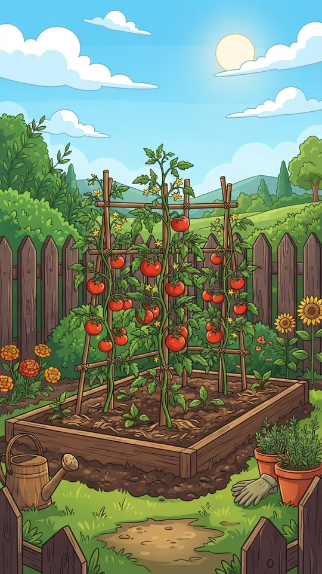 <b>1.</b> El Huerto de Tomates</td>
<td align="center">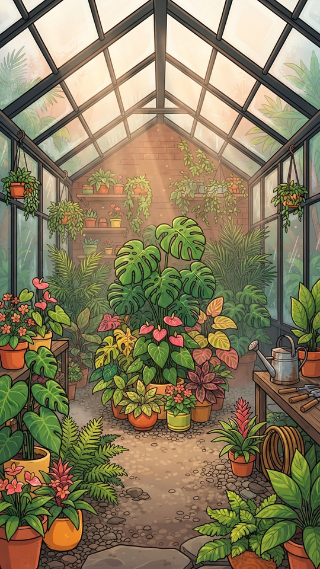 <b>2.</b> El Invernadero</td>
<td align="center"> <b>3.</b> La Cueva Subterránea</td>
<td align="center"> <b>4.</b> El Cultivo Radiactivo</td>
<td align="center"> <b>5.</b> El Pantano</td>
</tr>
<tr>
<td align="center"> <b>6.</b> Laboratorio Mutante</td>
<td align="center">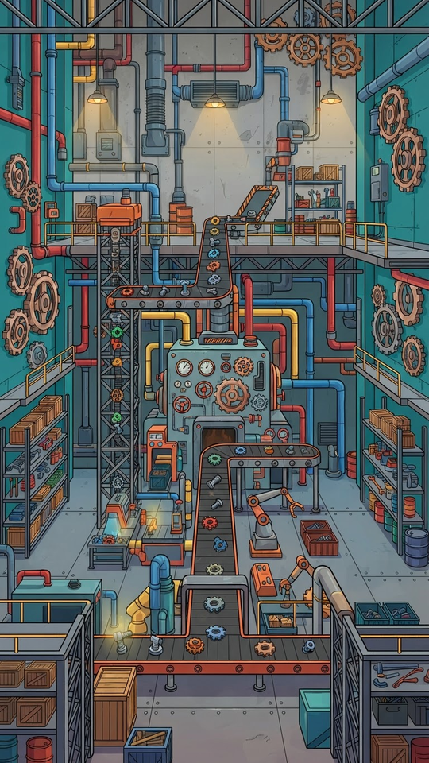 <b>7.</b> La Fábrica</td>
<td align="center"> <b>8.</b> Los Túneles</td>
<td align="center">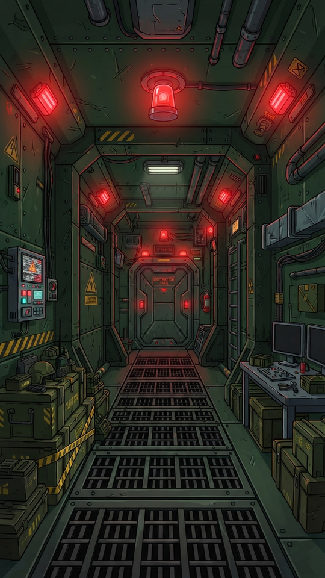 <b>9.</b> El Búnker</td>
<td align="center">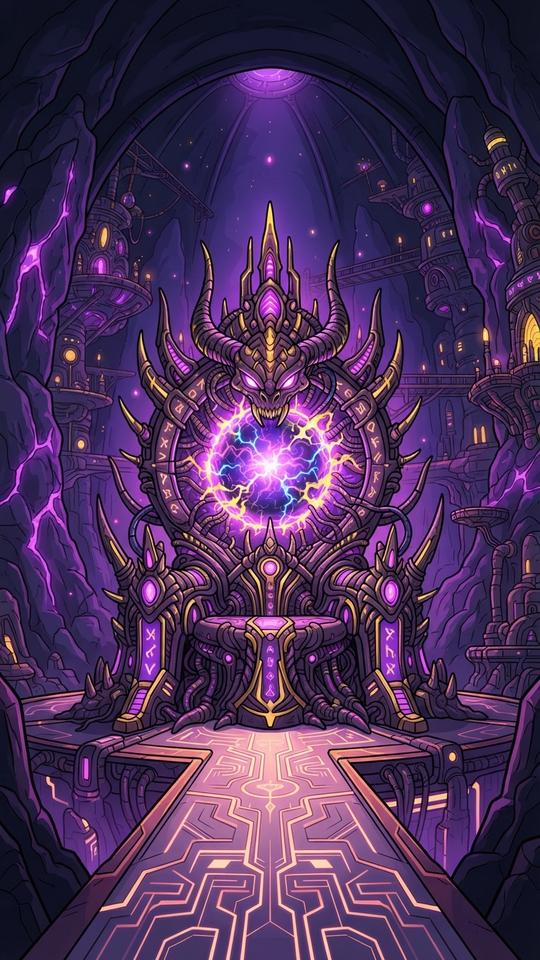 <b>10.</b> El Núcleo</td>
</tr>
</table>

---

## 📦 Ícono de la app

---

## Resumen

| | Cantidad |
|---|---|
| Insectos | 16 (5 comunes + 1 silueta + 10 incógnitos) |
| Cuadros de caminata | 4 (`hormiga_obrera`) |
| Retratos de Don Beto | 5 emociones + 1 cuerpo entero |
| Armas | 5 |
| Fondos de capítulo | 10 |
| Ícono | 1 |
| **Total de imágenes** | **42** |
| Pistas de música | 11 (Suno) |
| Efectos de sonido | 11 (CC0, Kenney.nl) |
